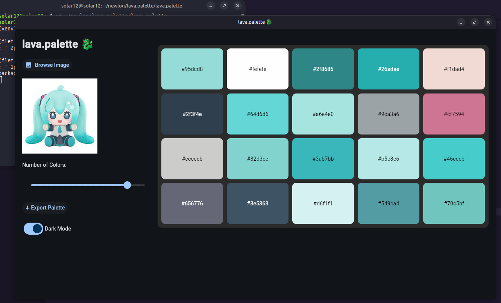

# lava.palette 🐉

**lava.palette** is a modern, cross-platform color palette generator built with [Flet](https://flet.dev/).  
Upload any image, extract a palette of dominant colors using KMeans clustering, preview the palette, and export it in `.gpl` and `.png` formats at multiple resolutions. All with a clean, responsive UI.

---

## 🎨 Features

- 🖼 Upload any image and preview it live
- 🎯 Extract dominant colors using **KMeans clustering**
- 🎚 Adjustable color count (2 to 24)
- 🌗 Dark/Light mode toggle
- 📁 Export to:
  - GIMP `.gpl` palette file
  - PNG strips at multiple resolutions (`x1`, `x8`, `x32`)
- 🕒 Automatically saves palette history to `palette_history.json`
- 🖥 Works offline with a beautiful native UI

---

## 📦 Requirements

- Python **3.8+**

Dependencies (listed in `req.txt`):

- flet
- pillow
- numpy
- scikit-learn


---

## 🚀 Getting Started

### ✅ Option 1: Auto-setup (Recommended)

Use the included `setup.py` to auto-create a virtual environment, install dependencies, and launch the app.

```bash
python setup.py
```

### ⚙️ Option 2: Manual Setup

```py
# 1. Create virtual environment
python -m venv venv

# 2. Activate the environment
# Windows:
venv\Scripts\activate
# macOS/Linux:
source venv/bin/activate

# 3. Install required packages
pip install -r req.txt

# 4. Run the app
python main.py
```

---

### 🖼 How It Works

Click "Browse Image" to upload any JPG or PNG image.

Use the slider to adjust how many dominant colors you want (2–24).

View a live preview of the color palette as swatches with hex codes.

Use "⬇ Export Palette" to save:
    - .gpl palette file
    - .png strips at x1, x8, and x32 resolutions

All exported files are saved to your system's Downloads folder.

### 📤 Exported Files

Exported palettes are saved as:

    {image_name}.gpl – GIMP color palette

    {image_name}_x1.png – Color strip (1px height)

    {image_name}_x8.png – Color strip (8px height)

    {image_name}_x32.png – Color strip (32px height)

Export folder: ~/Downloads (user's default Downloads directory)

### 📚 Dependencies

req.txt

- flet
- pillow
- numpy
- scikit-learn

Install with:

pip install -r req.txt

### 🧪 Tested On

    ✅ Linux mint 22.1

### 📸 Screenshots

    

🔒 License

This project is licensed under the MIT License.

<sup>🐉 lava.palette — Created with ❤️ by solar<sup>
